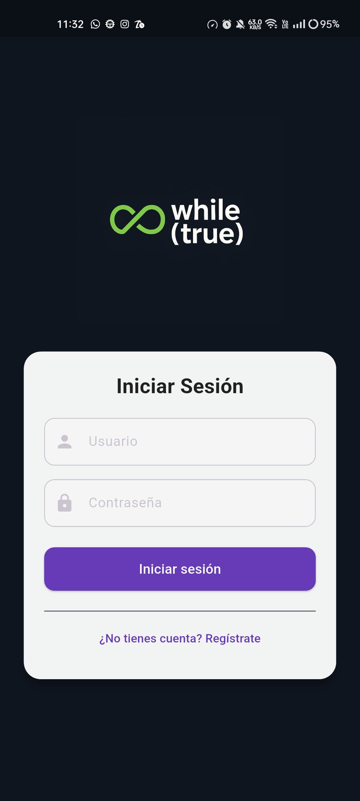
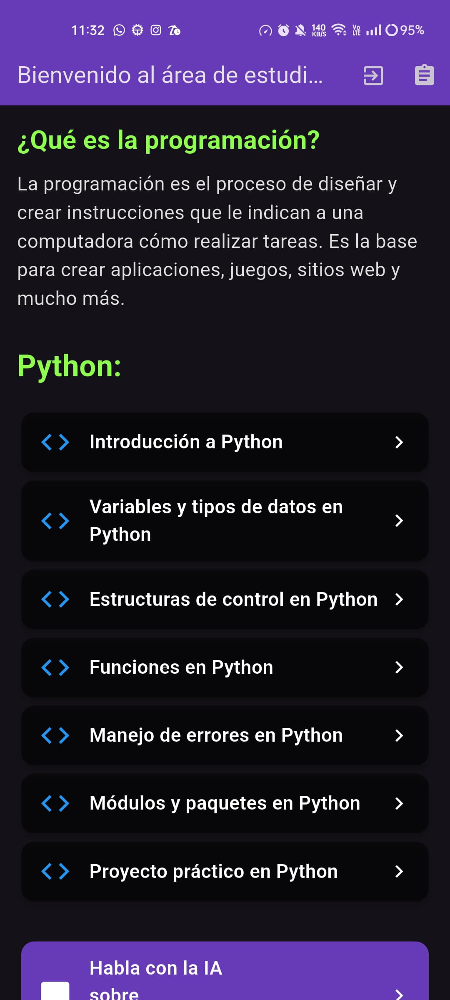
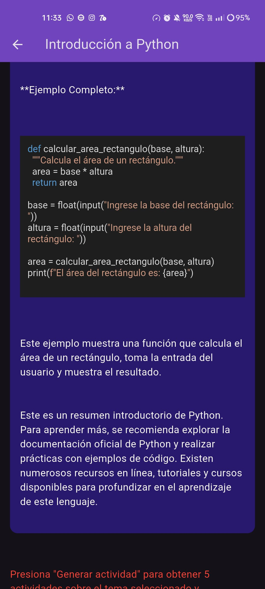
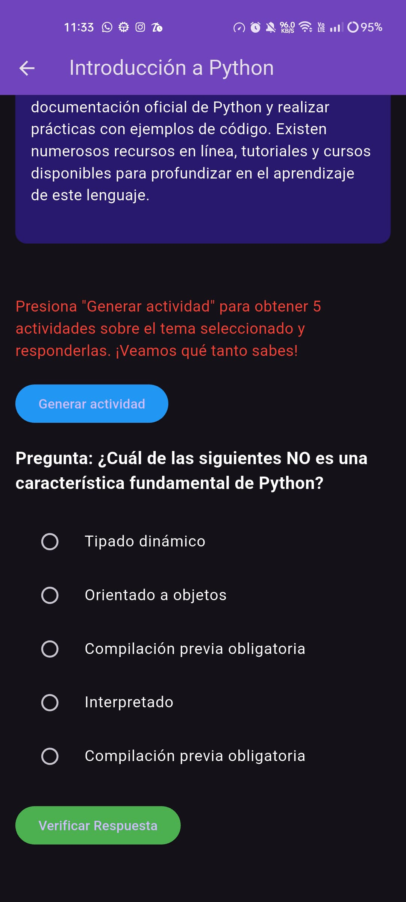
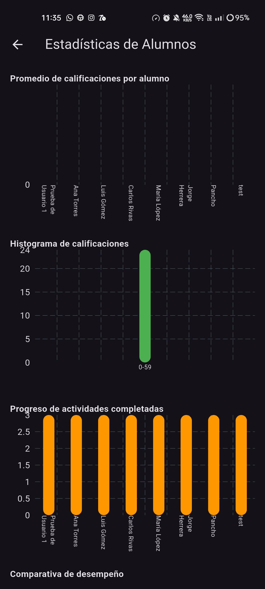
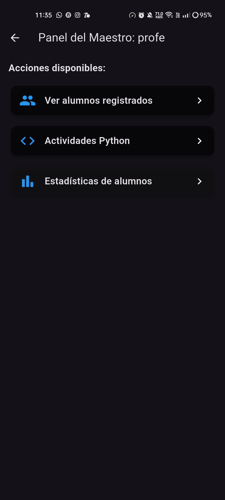
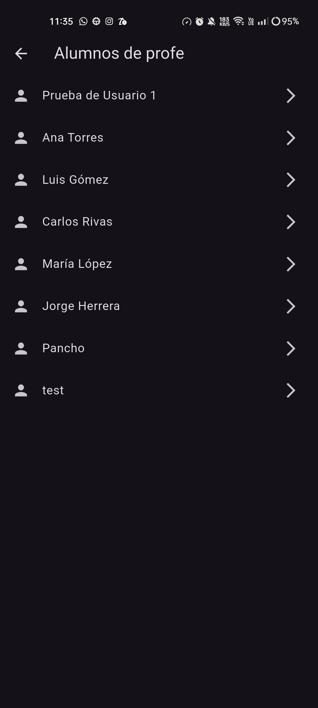
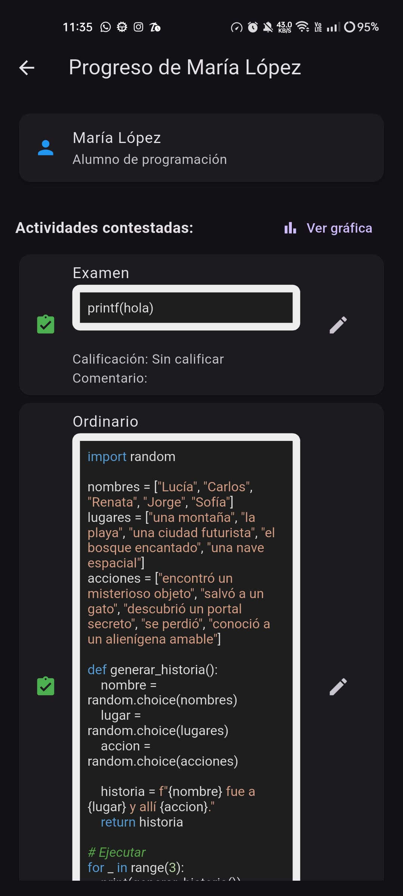
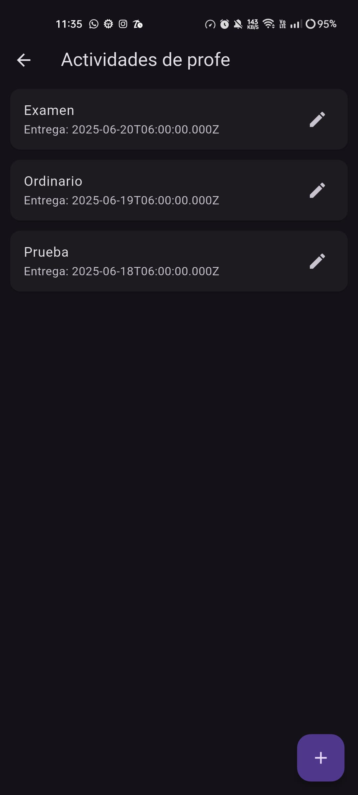

# While (True)
Proyecto final de Desarrollo de aplicaciones moviles.

**Integrantes del equipo:**
- Omar Francisco Hernandez Barragan
- Carlos Yael Casarin Rodriguez
- Carlos Ernesto Marcial Olmedo

## 🚀 Tecnologías usadas
- Flutter
- Dart
- Gemini 2.5 API
- NodeJS
- MySQL

## 🖼️ Capturas de Pantalla

### 🔐 Pantalla de Login

### 🏠 Home del Estudiante

### 📚 Lecciones

### ❓ Cuestionario

### 📊 Estadísticas del Alumno

### 👨‍🏫 Home del Profesor

### 👨‍🎓 Lista de Alumnos

### 📄 Detalle del Alumno

### 📝 Actividades del Profesor

